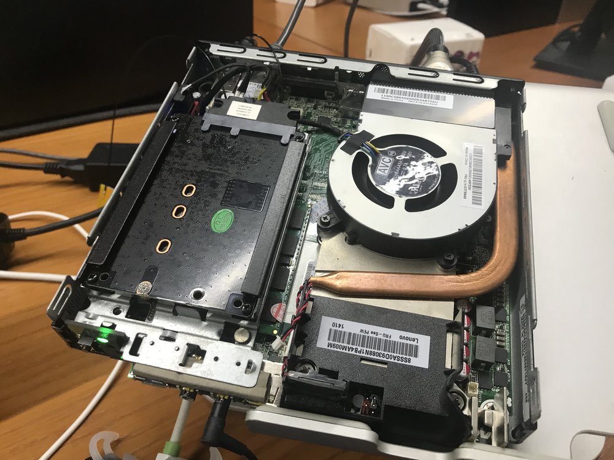

# Hackintosh for Lenovo M93P 



## 硬件概况

```
Computer model              Lenovo M93P
CPU                         Intel i7-4720HQ (8) @ 2.60GHz
Memory                      8g DDR3 1600 MHz Elpida x2 (16g)
Integrated graphics         Intel HD Graphics 4600
Audio                       Realtek @ Intel Lynx Point-LP High Definition Audio (ALC283)
Ethernet                    Realtek RTL8168/8111/8112 Gigabit Ethernet Controller / Lenovo
Wireless network adapter    Broadcom BCM43xx 1.0 (7.21.190.32 AirPortDriverBrcm4360-1315.1)
Operate System              Mojave 10.14.2
```

注：原先使用的是 i5-4570T CPU，后来因为性能的关系更改为 i7-4720HQ 的移动版魔改台式机 1150 型号。由于原机没有蓝牙和无线，因此加装了博通的 94352HMB 型号的网卡。

## BIOS 设置

1. 设置核显的初始内存为 64M（这块很重要，有坑）；
2. CPU 设置中，禁用 VT-d；
3. 只使用 UEFI 模式；
4. Disable Security Chip
5. Disable Anti Theft Module
6. Disable TPM

## 安装系统

安装最新版本的系统，个人使用的是「黑果小兵」的懒人包，目前支持的是 10.14.2 版本。

http://blog.daliansky.net/macOS-Mojave-10.14.2-18C54-official-version-with-Clover-4792-original-image.html

安装完系统以后，推荐使用 https://bitbucket.org/RehabMan/clover/downloads/ 的 Clover 编译版本。个人不是很推荐使用 MultiBeast 驱动硬件，因为对于系统的修改未知同时也影响后面的版本升级。

如果硬件和我上述的硬件清单差不多，那么直接覆盖 Clover 下的 EFI 文件夹重启即可（记得备份）。理论上，声卡以及后面加装的 Broadcom 无线网卡和蓝牙就可以驱动起来。

下面重点说明一些重要设备的驱动和调整：

## 显卡设置

设置显卡的过程有点难，原先使用是 i5-4570T CPU，其核显的型号是 HD4600，所以购买了笔记本的 CPU 型号也是 HD4600 。但是，同样的配置文件安装配置上去以后，出现了闪屏。

调试以后发现其实 `ig-platform-id` 是对的，但是需要打 DSDT 的补丁，这块是比较难点的地方。配置方面后来使用了 `FB-Patcher` 自动帮忙生成然后粘贴到 `config.plist` 里面搞定。

然而，<del>打完补丁以后显卡的型号从 `HD4600` 变成了 `Iris Pro` 但无闪屏了，原因未知</del>：


然后没有使用 `WhatEverGreen` 驱动，还是使用了仿冒的 FakePCIID 系列的驱动（注意，不要多加不必要的驱动，对稳定性没有任何的好处）。

HD4600 对应的 DSDT Patch，同时要注释掉原有的定义字段

```dsl
Method (_DSM, 4, NotSerialized)
{
    If (LEqual (Arg2, Zero)) { Return (Buffer() { 0x03 } ) }
    Return (Package()
    {
        "RM, device-id", Buffer() { 0x12, 0x04, 0x00, 0x00 }
    })
}
```

更新，使用 WhateverGreen.kext 进行新的显卡补丁操作，重新识别了对的型号同时解决了 Safari 下播放视频死机的问题。


总结下，删除 `ig-platform-id` 以及相关的定义，删除 `FakePCIID*` 系列内核扩展，并使用 `FB-Patcher` 制作补丁，同时应用 VRAM 补丁，具体参见这里：

https://www.tonymacx86.com/threads/an-idiots-guide-to-lilu-and-its-plug-ins.260063/


参考链接

* https://www.tonymacx86.com/threads/fix-intel-hd4200-hd4400-hd4600-mobile-on-yosemite.145427/
* https://github.com/RehabMan/OS-X-Fake-PCI-ID


## 声卡设置

声卡原先使用的是 AppleDHA 注入，考虑到这块需要拷贝扩展到 `S/L/E` 中并且对以后的升级也有可能存在问题，所以使用了 AppleALC + Lilu 以及 DSDT 配合注入的方式。

在这里还是建议使用 `FB-Patcher` 这个工具，它能半自动帮你搞定 `config.plist` 中的部分配置。

## CPU 调频


由于是小机箱，所以默认频率的发热比较严重，因此使用 `CPUFriend.kext` 这个扩展。详细信息可以看这里 https://github.com/acidanthera/CPUFriend ，目前我的方式是使用 `ssdtPRGen.sh` 这个脚本，然后合并 SSDT 的配置（[详细](https://github.com/acidanthera/CPUFriend/blob/master/Instructions.md)）。

## 其他

相比次的硬件（i5-4570T）这次的 EFI 目录更新主要是两个方面：

1. 精简了不必要的内核扩展（可能会更稳定和容易调试些）；
2. 使用了 DSDT 的全量补丁，驱动了移动版的 CPU 核显。

## 参考链接

* https://support.lenovo.com/us/zh/solutions/pd027573
* https://www.tonymacx86.com/threads/an-idiots-guide-to-lilu-and-its-plug-ins.260063/
* https://www.tonymacx86.com/threads/guide-intel-framebuffer-patching-using-whatevergreen.256490/
* https://www.tonymacx86.com/threads/solved-how-to-make-alc283-work.220295/
* https://www.tonymacx86.com/threads/setting-up-graphics-acceleration-for-intel-hd-4600.231454/
* https://ark.intel.com/compare/78934,75045
* https://www.tonymacx86.com/threads/tips-for-installing-sierra-on-lenovo-m93p-tiny-i7.267593